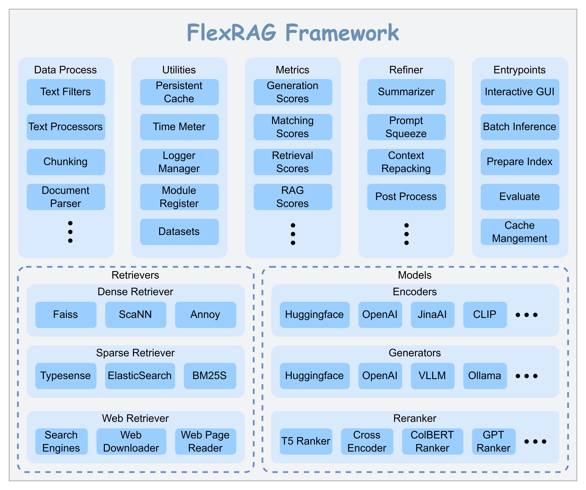

<p align="center">

</p>


[](LICENSE)
[](https://flexrag.readthedocs.io/en/latest/)
[](https://pypi.org/project/flexrag/)
[](https://doi.org/10.5281/zenodo.14593327)

\[ [English](README.md) | [中文](README-zh.md) \]

FlexRAG 是一个灵活的高性能框架，专为检索增强生成 (RAG) 任务而设计。FlexRAG 支持多模态数据，提供统一的配置管理及开箱即用的检索系统，为科研和原型设计提供充分支持。

# 📖 目录
- [📖 目录](#-目录)
- [✨ 框架特色](#-框架特色)
- [📢 最新消息](#-最新消息)
- [🚀 框架入门](#-框架入门)
  - [步骤0. 安装](#步骤0-安装)
    - [`pip`安装](#pip安装)
    - [源码安装](#源码安装)
  - [步骤1. 准备检索器](#步骤1-准备检索器)
    - [下载知识库](#下载知识库)
    - [构建索引](#构建索引)
  - [步骤2. 运行 FlexRAG Assistant](#步骤2-运行-flexrag-assistant)
    - [使用 GUI 运行 Modular Assistant](#使用-gui-运行-modular-assistant)
    - [在知识密集型数据集上运行并测试 Modular Assistant](#在知识密集型数据集上运行并测试-modular-assistant)
    - [开发您自己的 RAG Assistant](#开发您自己的-rag-assistant)
    - [开发您自己的 RAG 应用](#开发您自己的-rag-应用)
- [🏗️ FlexRAG 架构](#️-flexrag-架构)
- [📊 基准测试](#-基准测试)
- [🏷️ 许可证](#️-许可证)
- [❤️ 致谢](#️-致谢)


# ✨ 框架特色
- **多模态RAG**: FlexRAG 不仅限于基于文本的检索增强生成 (RAG)。它还支持多模态 RAG，为不同数据类型开辟了广泛的应用可能性。
- **多数据类型**: FlexRAG 支持多种数据格式，包括文本（例如 CSV、JSONL）、图像、文档、Web 快照等，让您可以灵活地处理各种数据源。
- **统一的配置管理**: 利用 python `dataclass` 和 [hydra-core](https://github.com/facebookresearch/hydra), FlexRAG 统一了配置管理，让 RAG 流程的配置变得更加简单。
- **开箱即用**: 通过精心优化的默认配置，FlexRAG 在默认配置下就有良好的性能，简化您的开发流程。
- **高性能**: 利用持久化缓存和异步函数，FlexRAG 显著提高了 RAG 流程的性能。
- **科研及开发友好**: 支持多种开发方式。此外，FlexRAG 提供了一个伴生仓库，[flexrag_examples](https://github.com/ictnlp/flexrag_examples)，来帮助您复现各类RAG算法。
- **轻量化**: FlexRAG 采用最少的开销设计，高效且易于集成到您的项目中。

# 📢 最新消息
- **2025-01-05**: FlexRAG 的[文档](https://flexrag.readthedocs.io/en/latest/)现已上线。

# 🚀 框架入门

## 步骤0. 安装

### `pip`安装
从 `pip` 安装 FlexRAG:
```bash
pip install flexrag
```

### 源码安装
此外，您也可以从源码安装 FlexRAG:
```bash
pip install pybind11

git clone https://github.com/ictnlp/flexrag.git
cd flexrag
pip install ./
```
您也可以通过 `-e` 标志在可编辑模式下安装 FlexRAG。


## 步骤1. 准备检索器

### 下载知识库
在开始构建您的RAG应用之前，您需要准备语料库。在本例中，我们将使用[DPR](https://github.com/facebookresearch/DPR)提供的维基百科语料库，您可以通过如下命令来下载语料库：
```bash
# Download the corpus
wget https://dl.fbaipublicfiles.com/dpr/wikipedia_split/psgs_w100.tsv.gz
# Unzip the corpus
gzip -d psgs_w100.tsv.gz
```

### 构建索引
下载语料库后，您需要为检索器构建索引。如果您想使用密集检索器，您可以运行以下命令来构建索引：
```bash
CORPUS_PATH=psgs_w100.tsv.gz
CORPUS_FIELDS='[title,text]'
DB_PATH=<path_to_database>

python -m flexrag.entrypoints.prepare_index \
    corpus_path=$CORPUS_PATH \
    saving_fields=$CORPUS_FIELDS \
    retriever_type=dense \
    dense_config.database_path=$DB_PATH \
    dense_config.encode_fields='[text]' \
    dense_config.passage_encoder_config.encoder_type=hf \
    dense_config.passage_encoder_config.hf_config.model_path='facebook/contriever' \
    dense_config.passage_encoder_config.hf_config.device_id=[0,1,2,3] \
    dense_config.index_type=faiss \
    dense_config.faiss_config.batch_size=4096 \
    dense_config.faiss_config.log_interval=100000 \
    dense_config.batch_size=4096 \
    dense_config.log_interval=100000 \
    reinit=True
```

如果您想使用稀疏检索器，您可以运行以下命令来构建索引：
```bash
CORPUS_PATH=psgs_w100.tsv.gz
CORPUS_FIELDS='[title,text]'
DB_PATH=<path_to_database>

python -m flexrag.entrypoints.prepare_index \
    corpus_path=$CORPUS_PATH \
    saving_fields=$CORPUS_FIELDS \
    retriever_type=bm25s \
    bm25s_config.database_path=$DB_PATH \
    bm25s_config.indexed_fields='[title,text]' \
    bm25s_config.method=lucene \
    bm25s_config.batch_size=512 \
    bm25s_config.log_interval=100000 \
    reinit=True
```

## 步骤2. 运行 FlexRAG Assistant
当索引准备好后，您可以运行 FlexRAG 所提供的 `Assistant` 。以下是如何运行`Modular Assistant`的示例。

### 使用 GUI 运行 Modular Assistant
```bash
python -m flexrag.entrypoints.run_interactive \
    assistant_type=modular \
    modular_config.used_fields=[title,text] \
    modular_config.retriever_type=dense \
    modular_config.dense_config.top_k=5 \
    modular_config.dense_config.database_path=${DB_PATH} \
    modular_config.dense_config.query_encoder_config.encoder_type=hf \
    modular_config.dense_config.query_encoder_config.hf_config.model_path='facebook/contriever' \
    modular_config.dense_config.query_encoder_config.hf_config.device_id=[0] \
    modular_config.response_type=short \
    modular_config.generator_type=openai \
    modular_config.openai_config.model_name='gpt-4o-mini' \
    modular_config.openai_config.api_key=$OPENAI_KEY \
    modular_config.do_sample=False
```

### 在知识密集型数据集上运行并测试 Modular Assistant
您可以在多个知识密集型数据集上轻松评估您的 RAG Assistant 。以下命令让您可以在 Natural Questions (NQ) 数据集上评估采用稠密检索器的`modular assistant`：
```bash
OUTPUT_PATH=<path_to_output>
DB_PATH=<path_to_database>
OPENAI_KEY=<your_openai_key>

python -m flexrag.entrypoints.run_assistant \
    data_path=flash_rag/nq/test.jsonl \
    output_path=${OUTPUT_PATH} \
    assistant_type=modular \
    modular_config.used_fields=[title,text] \
    modular_config.retriever_type=dense \
    modular_config.dense_config.top_k=10 \
    modular_config.dense_config.database_path=${DB_PATH} \
    modular_config.dense_config.query_encoder_config.encoder_type=hf \
    modular_config.dense_config.query_encoder_config.hf_config.model_path='facebook/contriever' \
    modular_config.dense_config.query_encoder_config.hf_config.device_id=[0] \
    modular_config.response_type=short \
    modular_config.generator_type=openai \
    modular_config.openai_config.model_name='gpt-4o-mini' \
    modular_config.openai_config.api_key=$OPENAI_KEY \
    modular_config.do_sample=False \
    eval_config.metrics_type=[retrieval_success_rate,generation_f1,generation_em] \
    eval_config.retrieval_success_rate_config.context_preprocess.processor_type=[simplify_answer] \
    eval_config.retrieval_success_rate_config.eval_field=text \
    eval_config.response_preprocess.processor_type=[simplify_answer] \
    log_interval=10
```

相似地，您可以在 Natural Questions 数据集上评估采用稀疏检索器的`modular assistant`：
```bash
OUTPUT_PATH=<path_to_output>
DB_PATH=<path_to_database>
OPENAI_KEY=<your_openai_key>

python -m flexrag.entrypoints.run_assistant \
    data_path=flash_rag/nq/test.jsonl \
    output_path=${OUTPUT_PATH} \
    assistant_type=modular \
    modular_config.used_fields=[title,text] \
    modular_config.retriever_type=bm25s \
    modular_config.bm25s_config.top_k=10 \
    modular_config.bm25s_config.database_path=${DB_PATH} \
    modular_config.response_type=short \
    modular_config.generator_type=openai \
    modular_config.openai_config.model_name='gpt-4o-mini' \
    modular_config.openai_config.api_key=$OPENAI_KEY \
    modular_config.do_sample=False \
    eval_config.metrics_type=[retrieval_success_rate,generation_f1,generation_em] \
    eval_config.retrieval_success_rate_config.context_preprocess.processor_type=[simplify_answer] \
    eval_config.retrieval_success_rate_config.eval_field=text \
    eval_config.response_preprocess.processor_type=[simplify_answer] \
    log_interval=10
```

您也可以通过在命令行中添加 `user_module=<your_module_path>` 参数来评估您自己的助手。

### 开发您自己的 RAG Assistant
您也可以通过导入所需的 FlexRAG 模块来创建您自己的 RAG Assistant。以下是如何构建 RAG Assistant 的示例：
```python
from dataclasses import dataclass

from flexrag.assistant import ASSISTANTS, AssistantBase
from flexrag.models import OpenAIGenerator, OpenAIGeneratorConfig
from flexrag.prompt import ChatPrompt, ChatTurn
from flexrag.retriever import DenseRetriever, DenseRetrieverConfig


@dataclass
class SimpleAssistantConfig(DenseRetrieverConfig, OpenAIGeneratorConfig): ...


@ASSISTANTS("simple", config_class=SimpleAssistantConfig)
class SimpleAssistant(AssistantBase):
    def __init__(self, config: SimpleAssistantConfig):
        self.retriever = DenseRetriever(config)
        self.generator = OpenAIGenerator(config)
        return

    def answer(self, question: str) -> str:
        prompt = ChatPrompt()
        context = self.retriever.search(question)[0]
        prompt_str = ""
        for ctx in context:
            prompt_str += f"Question: {question}\nContext: {ctx.data['text']}"
        prompt.update(ChatTurn(role="user", content=prompt_str))
        response = self.generator.chat([prompt])[0][0]
        prompt.update(ChatTurn(role="assistant", content=response))
        return response
```
在完成`SimpleAssistant`定义并使用`ASSISTANTS`装饰器注册该 Assistant 后，您可以通过以下方式来运行您的 Assistant：
```bash
DB_PATH=<path_to_database>
OPENAI_KEY=<your_openai_key>
DATA_PATH=<path_to_data>
MODULE_PATH=<path_to_simple_assistant_module>

python -m flexrag.entrypoints.run_assistant \
    user_module=${MODULE_PATH} \
    data_path=${DATA_PATH} \
    assistant_type=simple \
    simple_config.model_name='gpt-4o-mini' \
    simple_config.api_key=${OPENAI_KEY} \
    simple_config.database_path=${DB_PATH} \
    simple_config.index_type=faiss \
    simple_config.query_encoder_config.encoder_type=hf \
    simple_config.query_encoder_config.hf_config.model_path='facebook/contriever' \
    simple_config.query_encoder_config.hf_config.device_id=[0] \
    eval_config.metrics_type=[retrieval_success_rate,generation_f1,generation_em] \
    eval_config.retrieval_success_rate_config.eval_field=text \
    eval_config.response_preprocess.processor_type=[simplify_answer] \
    log_interval=10
```
在 [flexrag_examples](https://github.com/ictnlp/flexrag_examples) 仓库中，我们也提供了一些示例，详细展示了如何利用 FlexRAG 框架构建 RAG 助手。

### 开发您自己的 RAG 应用
除了直接使用 FlexRAG 内置的 Entrypoints 来运行您的 RAG Assistant 以外，您也可以直接使用 FlexRAG 构建您自己的 RAG 应用。以下是如何构建 RAG 应用的示例：
```python
from flexrag.models import HFEncoderConfig, OpenAIGenerator, OpenAIGeneratorConfig
from flexrag.prompt import ChatPrompt, ChatTurn
from flexrag.retriever import DenseRetriever, DenseRetrieverConfig


def main():
    # Initialize the retriever
    retriever_cfg = DenseRetrieverConfig(database_path="path_to_database", top_k=1)
    retriever_cfg.query_encoder_config.encoder_type = "hf"
    retriever_cfg.query_encoder_config.hf_config = HFEncoderConfig(
        model_path="facebook/contriever"
    )
    retriever = DenseRetriever(retriever_cfg)

    # Initialize the generator
    generator = OpenAIGenerator(
        OpenAIGeneratorConfig(
            model_name="gpt-4o-mini", api_key="your_openai_key", do_sample=False
        )
    )

    # Run your RAG application
    prompt = ChatPrompt()
    while True:
        query = input("Please input your query (type `exit` to exit): ")
        if query == "exit":
            break
        context = retriever.search(query)[0]
        prompt_str = ""
        for ctx in context:
            prompt_str += f"Question: {query}\nContext: {ctx.data['text']}"
        prompt.update(ChatTurn(role="user", content=prompt_str))
        response = generator.chat(prompt)
        prompt.update(ChatTurn(role="assistant", content=response))
        print(response)
    return


if __name__ == "__main__":
    main()
```
更多使用 FlexRAG 构建 RAG 应用的示例，请参考 [flexrag_examples](https://github.com/ictnlp/flexrag_examples) 仓库。


# 🏗️ FlexRAG 架构
FlexRAG 采用**模块化**架构设计，让您可以轻松定制和扩展框架以满足您的特定需求。下图说明了 FlexRAG 的架构：
<p align="center">

</p>

# 📊 基准测试
我们利用 FlexRAG 进行了大量的基准测试，详情请参考 [benchmarks](benchmarks.md) 页面。

# 🏷️ 许可证
本仓库采用 **MIT License** 开源协议. 详情请参考 [LICENSE](LICENSE) 文件。


<!-- # 🖋️ 引用
如果您觉得 FlexRAG 对您的研究有所帮助，请引用我们的工作:

```bibtex
@software{FlexRAG,
  author = {Zhang Zhuocheng},
  doi = {10.5281/zenodo.14306984},
  month = {12},
  title = {{FlexRAG}},
  url = {https://github.com/ictnlp/flexrag},
  version = {0.1.0},
  year = {2024}
}
``` -->

# ❤️ 致谢
下面的开源项目对本项目有所帮助:
- [Faiss](https://github.com/facebookresearch/faiss)
- [FlashRAG](https://github.com/RUC-NLPIR/FlashRAG)
- [LanceDB](https://github.com/lancedb/lancedb)
- [ANN Benchmarks](https://github.com/erikbern/ann-benchmarks)
- [Chonkie](https://github.com/chonkie-ai/chonkie)
- [rerankers](https://github.com/AnswerDotAI/rerankers)
