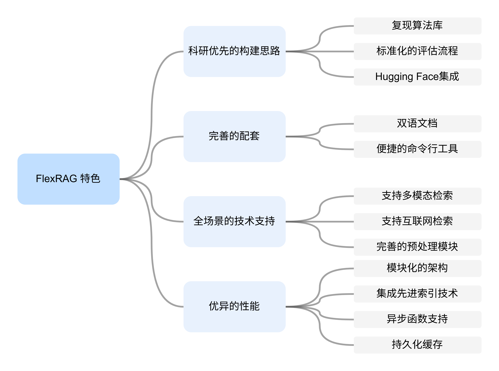
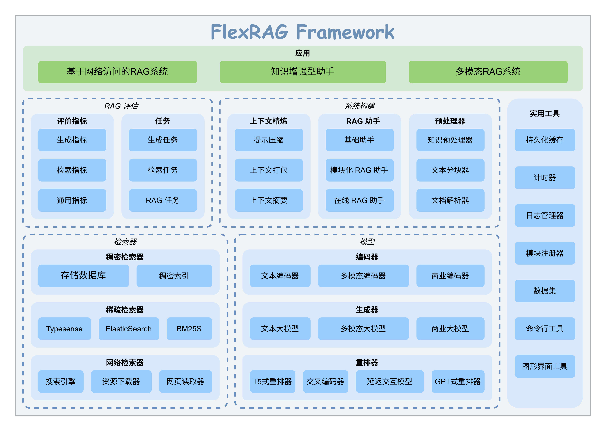

<p align="center">

</p>


[](https://github.com/psf/black)
[](https://pycqa.github.io/isort/)
[](LICENSE)
[](https://flexrag.readthedocs.io/en/latest/)
[](https://flexrag.readthedocs.io/zh-cn/latest/)
[](https://pypi.org/project/flexrag/)
[](https://doi.org/10.5281/zenodo.14306983)

<p align="center">
|
<a href="https://www.bilibili.com/video/BV13rZbYDEHZ"><b>介绍视频</b></a> |
<a href="./README.md"><b>README (english)</b></a> |
<a href="https://flexrag.readthedocs.io/zh-cn/latest/"><b>文档</b></a> |
<a href="https://huggingface.co/collections/ICTNLP/flexrag-retrievers-67b5373b70123669108a2e59"><b>检索器</b></a> |
<a href="https://github.com/ictnlp/FlexRAG_Examples"><b>示例</b></a>
|
</p>

FlexRAG 是一个创新的开源框架，旨在简化 RAG（检索增强生成）系统的快速复现、开发和评估。它全面支持多种 RAG 场景，包括 **基于文本的、多模态的以及可通过 Web 访问的 RAG** 。借助从数据准备到系统评估的**端到端流水线**，FlexRAG 能够帮助研究人员高效地与社区共享他们的工作，并快速基于自己的算法开发演示原型。

# 📖 目录
- [📖 目录](#-目录)
- [✨ 框架特色](#-框架特色)
- [📢 最新消息](#-最新消息)
- [🚀 框架入门](#-框架入门)
- [🏗️ FlexRAG 架构](#️-flexrag-架构)
- [📊 基准测试](#-基准测试)
- [🏷️ 许可证](#️-许可证)
- [🖋️ 引用](#️-引用)
- [❤️ 致谢](#️-致谢)


# ✨ 框架特色
<p align="center">

</p>

# 📢 最新消息
- **2025-03-24**: 中文文档上线啦！请访问 [文档](https://flexrag.readthedocs.io/zh-cn/latest/) 查看。
- **2025-02-25**: FlexRAG 的 LocalRetriever 现在支持从 [HuggingFace Hub](https://huggingface.co/collections/ICTNLP/flexrag-retrievers-67b5373b70123669108a2e59) 上加载啦！
- **2025-01-22**: 新的命令行入口 `run_retriever` 以及大量新的信息检索指标（如 `RetrievalMAP` ）现已上线，请阅读[文档](https://flexrag.readthedocs.io/en/latest/)以获取更多信息。
- **2025-01-08**: FlexRAG 现已支持 Windows 系统，您可以直接通过 `pip install flexrag` 来安装。
- **2025-01-08**: FlexRAG 在单跳QA数据集上的基准测试现已公开，详情请参考 [benchmarks](benchmarks/README.md) 页面。
- **2025-01-05**: FlexRAG 的[文档](https://flexrag.readthedocs.io/en/latest/)现已上线。

# 🚀 框架入门
从 `pip` 安装 FlexRAG:
```bash
pip install flexrag
```

访问我们的[文档](https://flexrag.readthedocs.io/zh-cn/latest/)以了解更多信息。
- [安装](https://flexrag.readthedocs.io/zh-cn/latest/getting_started/installation.html)
- [快速入门](https://flexrag.readthedocs.io/zh-cn/latest/getting_started/quickstart1.html)
- [教程](https://flexrag.readthedocs.io/zh-cn/latest/tutorial/preparing_corpus.html)

# 🏗️ FlexRAG 架构
FlexRAG 采用**模块化**架构设计，让您可以轻松定制和扩展框架以满足您的特定需求。下图说明了 FlexRAG 的架构：
<p align="center">

</p>

# 📊 基准测试
我们利用 FlexRAG 进行了大量的基准测试，详情请参考 [benchmarks](benchmarks/README.md) 页面。

# 🏷️ 许可证
本仓库采用 **MIT License** 开源协议. 详情请参考 [LICENSE](LICENSE) 文件。

# 🖋️ 引用
如果您在研究中使用了 FlexRAG，请引用我们的项目：
```bibtex
@software{Zhang_FlexRAG_2025,
author = {Zhang, Zhuocheng and Feng, Yang and Zhang, Min},
doi = {10.5281/zenodo.14593327},
month = jan,
title = {{FlexRAG}},
url = {https://github.com/ictnlp/FlexRAG},
year = {2025}
}
```


# ❤️ 致谢
下面的开源项目对本项目有所帮助:
- [Faiss](https://github.com/facebookresearch/faiss)
- [FlashRAG](https://github.com/RUC-NLPIR/FlashRAG)
- [LanceDB](https://github.com/lancedb/lancedb)
- [ANN Benchmarks](https://github.com/erikbern/ann-benchmarks)
- [Chonkie](https://github.com/chonkie-ai/chonkie)
- [rerankers](https://github.com/AnswerDotAI/rerankers)
