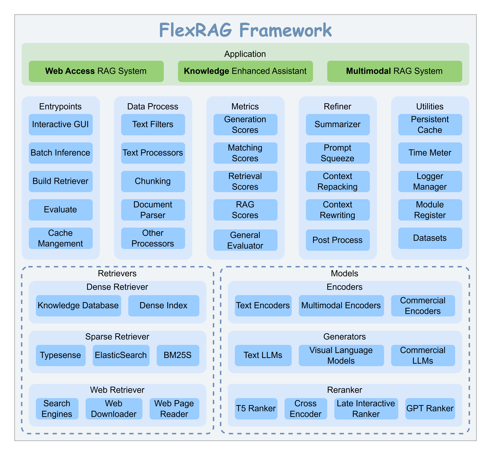

<p align="center">

</p>


[](https://github.com/psf/black)
[](https://pycqa.github.io/isort/)
[](LICENSE)
[](https://flexrag.readthedocs.io/en/latest/)
[](https://pypi.org/project/flexrag/)
[](https://doi.org/10.5281/zenodo.14593327)

\[ [English](README.md) | [中文](README-zh.md) \]

FlexRAG is a flexible and high-performance framework designed for Retrieval-Augmented Generation (RAG) tasks, offering support for multimodal data, seamless configuration management, and out-of-the-box performance for both research and prototyping.

https://github.com/user-attachments/assets/4dfc0ec9-686b-40e2-b1f0-daa2b918e093

# 📖 Table of Contents
- [📖 Table of Contents](#-table-of-contents)
- [✨ Key Features](#-key-features)
- [📢 News](#-news)
- [🚀 Getting Started](#-getting-started)
- [🏗️ Architecture](#️-architecture)
- [📊 Benchmarks](#-benchmarks)
- [🏷️ License](#️-license)
- [❤️ Acknowledgements](#️-acknowledgements)


# ✨ Key Features
- **Multimodal RAG Support**: FlexRAG isn't limited to just text-based Retrieval-Augmented Generation (RAG). It also supports multimodal RAG, opening up a wide range of application possibilities across different media types.
- **Diverse Data Types**: FlexRAG enables seamless integration of multiple data formats, including text (e.g., CSV, JSONL), images, documents, web snapshots, and more, giving you flexibility in working with varied data sources.
- **Unified Configuration Management**: Leveraging python `dataclass` and [hydra-core](https://github.com/facebookresearch/hydra), FlexRAG simplifies configuration management, making it easier to handle complex setups and customize your workflow.
- **Out-of-the-Box**: With carefully optimized default configurations, FlexRAG delivers solid performance without the need for extensive parameter tuning.
- **High Performance**: Built with persistent cache system and asynchronous methods to significantly improve speed and reduce latency in RAG workflows.
- **Research & Development Friendly**: Supports multiple development modes and includes a companion repository, [flexrag_examples](https://github.com/ictnlp/flexrag_examples), to help you reproduce various RAG algorithms with ease.
- **Lightweight**: Designed with minimal overhead, FlexRAG is efficient and easy to integrate into your project.

# 📢 News
- **2025-2-25**: FlexRAG's LocalRetriever now supports loading from the [HuggingFace Hub](https://huggingface.co/collections/ICTNLP/flexrag-retrievers-67b5373b70123669108a2e59).
- **2025-01-22**: A new entrypoint `run_retriever` and four new information retrieval metrics (e.g., `RetrievalMAP`) are now available. Check out the [documentation](https://flexrag.readthedocs.io/en/latest/) for more details.
- **2025-01-08**: We provide Windows wheels for FlexRAG. You can install FlexRAG via pip on Windows now.
- **2025-01-08**: The benchmark of FlexRAG on Single-hop QA tasks is now available. Check out the [benchmarks](benchmarks/README.md) for more details.
- **2025-01-05**: Documentation for FlexRAG is now available. Check out the [documentation](https://flexrag.readthedocs.io/en/latest/) for more details.

# 🚀 Getting Started
To install FlexRAG via pip:
```bash
pip install flexrag
```

Visit our [documentation](https://flexrag.readthedocs.io/en/latest/) to learn more.
- [Installation](https://flexrag.readthedocs.io/en/latest/getting_started/installation.html)
- [Quickstart](https://flexrag.readthedocs.io/en/latest/getting_started/quickstart.html)
- [Entrypoints](https://flexrag.readthedocs.io/en/latest/tutorial/entrypoints.html)


# 🏗️ Architecture
FlexRAG is designed with a **modular** architecture, allowing you to easily customize and extend the framework to meet your specific needs. The following diagram illustrates the architecture of FlexRAG:
<p align="center">

</p>

# 📊 Benchmarks
We have conducted extensive benchmarks using the FlexRAG framework. For more details, please refer to the [benchmarks](benchmarks/README.md) page.

# 🏷️ License
This repository is licensed under the **MIT License**. See the [LICENSE](LICENSE) file for details.

# ❤️ Acknowledgements
This project benefits from the following open-source projects:
- [Faiss](https://github.com/facebookresearch/faiss)
- [FlashRAG](https://github.com/RUC-NLPIR/FlashRAG)
- [LanceDB](https://github.com/lancedb/lancedb)
- [ANN Benchmarks](https://github.com/erikbern/ann-benchmarks)
- [Chonkie](https://github.com/chonkie-ai/chonkie)
- [rerankers](https://github.com/AnswerDotAI/rerankers)
