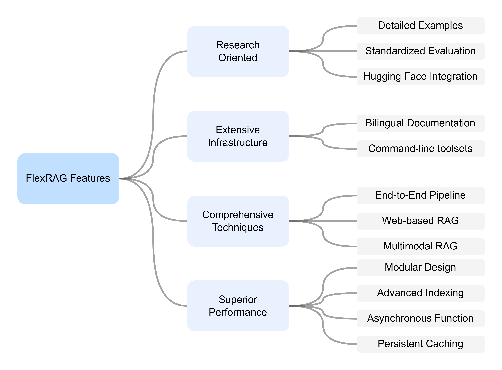
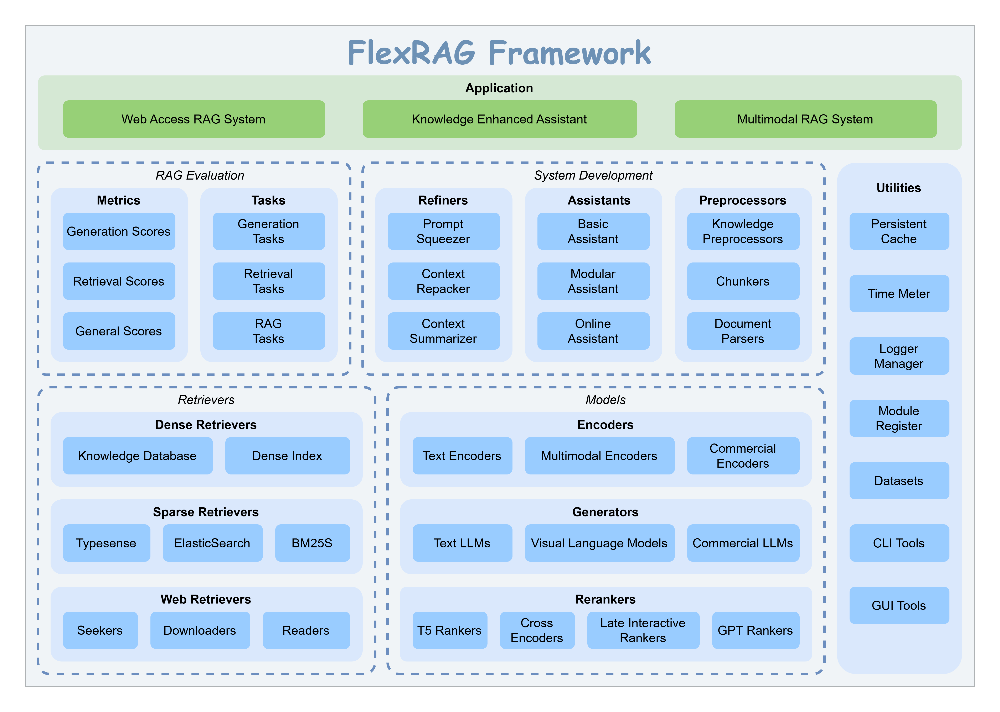

<p align="center">

</p>


[](https://github.com/psf/black)
[](https://pycqa.github.io/isort/)
[](LICENSE)
[](https://flexrag.readthedocs.io/en/latest/)
[](https://flexrag.readthedocs.io/zh-cn/latest/)
[](https://pypi.org/project/flexrag/)
[](https://doi.org/10.5281/zenodo.14306983)

<p align="center">
|
<a href="https://youtu.be/a1XPiwdGzuM"><b>Introduction Video</b></a> |
<a href="./README-zh.md"><b>README (chinese)</b></a> |
<a href="https://flexrag.readthedocs.io/en/latest/"><b>Documentation</b></a> |
<a href="https://huggingface.co/collections/ICTNLP/flexrag-retrievers-67b5373b70123669108a2e59"><b>Retrievers</b></a> |
<a href="https://github.com/ictnlp/flexrag_examples"><b>Examples</b></a>
|
</p>

FlexRAG is an innovative open-source framework designed to streamline the rapid reproduction, development, and evaluation of Retrieval-Augmented Generation (RAG) systems. It provides comprehensive support for various RAG scenarios, including **text-based**, **multimodal**, and **web-accessible** applications. With an **end-to-end pipeline** covering everything from data preparation to system evaluation, FlexRAG empowers researchers to efficiently **share their work** with the community and swiftly develop demonstrative prototypes based on their algorithms.

****

# 📖 Table of Contents
- [📖 Table of Contents](#-table-of-contents)
- [✨ Key Features](#-key-features)
- [📢 News](#-news)
- [🚀 Getting Started](#-getting-started)
- [🏗️ Architecture](#️-architecture)
- [📊 Benchmarks](#-benchmarks)
- [🏷️ License](#️-license)
- [🖋️ Citation](#️-citation)
- [❤️ Acknowledgements](#️-acknowledgements)


# ✨ Key Features
<p align="center">

</p>


# 📢 News
- **2025-03-24**: The Chinese documentation is now available! Please visit the [documentation](https://flexrag.readthedocs.io/zh-cn/latest/) for more details.
- **2025-02-25**: FlexRAG's LocalRetriever now supports loading from the [HuggingFace Hub](https://huggingface.co/collections/ICTNLP/flexrag-retrievers-67b5373b70123669108a2e59).
- **2025-01-22**: A new entrypoint `run_retriever` and four new information retrieval metrics (e.g., `RetrievalMAP`) are now available. Check out the [documentation](https://flexrag.readthedocs.io/en/latest/) for more details.
- **2025-01-08**: We provide Windows wheels for FlexRAG. You can install FlexRAG via pip on Windows now.
- **2025-01-08**: The benchmark of FlexRAG on Single-hop QA tasks is now available. Check out the [benchmarks](benchmarks/README.md) for more details.
- **2025-01-05**: Documentation for FlexRAG is now available. Check out the [documentation](https://flexrag.readthedocs.io/en/latest/) for more details.

# 🚀 Getting Started
To install FlexRAG via pip:
```bash
pip install flexrag
```

Visit our [documentation](https://flexrag.readthedocs.io/en/latest/) to learn more.
- [Installation](https://flexrag.readthedocs.io/en/latest/getting_started/installation.html)
- [Quickstart](https://flexrag.readthedocs.io/en/latest/getting_started/quickstart1.html)
- [Tutorial](https://flexrag.readthedocs.io/en/latest/tutorial/preparing_corpus.html)


# 🏗️ Architecture
FlexRAG is designed with a **modular** architecture, allowing you to easily customize and extend the framework to meet your specific needs. The following diagram illustrates the architecture of FlexRAG:
<p align="center">

</p>

# 📊 Benchmarks
We have conducted extensive benchmarks using the FlexRAG framework. For more details, please refer to the [benchmarks](benchmarks/README.md) page.

# 🏷️ License
This repository is licensed under the **MIT License**. See the [LICENSE](LICENSE) file for details.

# 🖋️ Citation
If you use FlexRAG in your research, please cite our project:
```bibtex
@software{Zhang_FlexRAG_2025,
author = {Zhang, Zhuocheng and Feng, Yang and Zhang, Min},
doi = {10.5281/zenodo.14593327},
month = jan,
title = {{FlexRAG}},
url = {https://github.com/ictnlp/FlexRAG},
year = {2025}
}
```

# ❤️ Acknowledgements
This project benefits from the following open-source projects:
- [Faiss](https://github.com/facebookresearch/faiss)
- [FlashRAG](https://github.com/RUC-NLPIR/FlashRAG)
- [LanceDB](https://github.com/lancedb/lancedb)
- [ANN Benchmarks](https://github.com/erikbern/ann-benchmarks)
- [Chonkie](https://github.com/chonkie-ai/chonkie)
- [rerankers](https://github.com/AnswerDotAI/rerankers)
